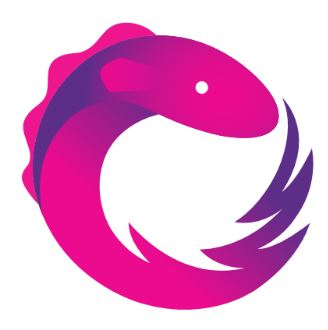

## Hello, I'm [Adrian Bielawski](https://adrian.bielaw.ski)

I am a front-end developer with 2 years experience and I am in love with TypeScript and React.  
I am based in London, England where I am working as intern for [Apperio](https://apperio.com).

## My projects

- [Catalogues](https://catalogues.adrian.bielaw.ski)
- [React components](https://components.adrian.bielaw.ski)
- [Scrapple](https://scrapple.adrian.bielaw.ski)
- [Rummikup](https://rummikup.adrian.bielaw.ski)

## Published on [NPM](https://npmjs.com/~adrianbielawski)

- [Orderable list](https://www.npmjs.com/package/@adrianbielawski/orderable-list)
- [useSwipe React hook](https://www.npmjs.com/package/@adrianbielawski/use-swipe)

## Skils

    
    &nbsp;&nbsp;&nbsp;&nbsp;
    
    &nbsp;&nbsp;&nbsp;&nbsp;
    
    &nbsp;&nbsp;&nbsp;&nbsp;
    
    &nbsp;&nbsp;&nbsp;&nbsp;
    
    &nbsp;&nbsp;&nbsp;&nbsp;
    
    &nbsp;&nbsp;&nbsp;&nbsp;
    
    &nbsp;&nbsp;&nbsp;&nbsp;
    
    &nbsp;&nbsp;&nbsp;&nbsp;
    
    &nbsp;&nbsp;&nbsp;&nbsp;
    
    &nbsp;&nbsp;&nbsp;&nbsp;
    
    &nbsp;&nbsp;&nbsp;&nbsp;
    

## Github stats

